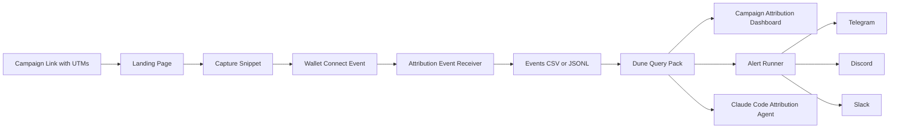

# onchain-attribution-kit

Open-source onchain attribution for Web3 growth teams. Capture UTMs at wallet connect, join campaigns to Dune activity, alert to Telegram, Discord, or Slack.

[](https://www.typescriptlang.org/)
[](https://nodejs.org/)
[](LICENSE)
[](https://dune.com)
[](https://github.com/gmangabeira/onchain-attribution-kit/pulls)

*Built by [Gabriel Mangabeira](https://mangabeira.net) — Web3 growth consultant*




---

## Table of Contents

- [The problem](#the-problem)
- [Who this is for](#who-this-is-for)
- [Quickstart](#quickstart)
- [What an alert looks like](#what-an-alert-looks-like)
- [What's included](#whats-included)
- [Dune SQL query pack](#dune-sql-query-pack)
- [Claude Code agent](#claude-code-agent)
- [Attribution payload schema](#attribution-payload-schema)
- [Environment variables](#environment-variables)
- [Production considerations](#production-considerations)
- [Limitations](#limitations)
- [Contributing](#contributing)
- [Built by](#built-by)

---

## The problem

GA4 sees the click. Dune sees the transaction. Nothing connects them.

Web3 protocols spend on influencers, paid social, and KOL campaigns and have no way to know which of those wallets ever did a swap, staked, or bridged. This kit fills that gap with a lightweight, forkable attribution layer you own entirely.

## Who this is for

- **Web3 growth leads** who need to know which campaigns produce wallets that actually transact, not just connect
- **Protocol engineers** who want reusable, commented templates for attribution plumbing
- **Web3 growth agencies and consultants** who need a repeatable attribution baseline for clients

---

## Quickstart

```bash
# 1. Clone the repo
git clone https://github.com/gmangabeira/onchain-attribution-kit.git
cd onchain-attribution-kit

# 2. Install dependencies
npm install

# 3. Configure env vars
cp .env.example .env
# Edit .env: set ONCHAIN_ATTRIBUTION_WRITE_KEY and optionally alert vars

# 4. Start the local server
npm run dev

# 5. Open the test page with UTM params to simulate an attribution event
# http://localhost:3000/?utm_source=x&utm_medium=social&utm_campaign=launch-q2-2026&utm_content=thread-01
```

Click "Connect Wallet" on the test page to fire an attribution event, then verify it was stored:

```bash
cat data/events.jsonl
```

Test alert formatting (dry run, no messages sent):

```bash
npm run test:alert
```

---

## What an alert looks like

When a campaign crosses your conversion threshold, the alert runner sends a formatted summary to Telegram, Discord, or Slack:

```
Onchain attribution alert

Campaign: launch-q2-2026
Source: x / social
Wallets captured: 42
Converted wallets: 9
Conversion rate: 21.4%
Top action: first_swap
Window: last 24h
```

Three channels are supported equally. See [`docs/alerts.md`](docs/alerts.md) for setup.

---

## What's included

### 1. Capture snippet (`src/capture/browser-snippet.ts`)

- Reads UTM params and crypto-native campaign params (`ref`, `kol`, `invite`, `campaign_id`)
- Persists campaign context in `localStorage` for a configurable window (default: 7 days)
- On wallet connect, POSTs an attribution payload to your backend
- Privacy-by-default: no email, IP, or device fingerprint collected
- Opt-out: `window.ONCHAIN_ATTRIBUTION_DISABLED = true`

### 2. Event receiver (`src/server/api.ts`)

- `POST /api/attribution/event` — validates and stores events
- `GET /api/health` — health check
- `GET /api/events.csv` — CSV export for Dune (dev only)
- Auth via `ONCHAIN_ATTRIBUTION_WRITE_KEY` header
- Default storage: append-only JSONL + CSV at `data/events.jsonl` / `data/events.csv`

### 3. Alert channels (`src/alerts/`)

| Channel | Format | File |
|---|---|---|
| Telegram | Plain text | `src/alerts/telegram.ts` |
| Discord | Markdown | `src/alerts/discord.ts` |
| Slack | Block Kit | `src/alerts/slack.ts` |

Send to a specific channel:

```bash
ts-node scripts/send-test-alert.ts --channel telegram
```

### 4. Documentation (`docs/`)

- [Setup guide](docs/setup.md)
- [Campaign schema and UTM taxonomy](docs/campaign-schema.md)
- [Dune setup](docs/dune-setup.md)
- [Alerts overview](docs/alerts.md)
- [Telegram setup](docs/telegram.md)
- [Discord setup](docs/discord.md)
- [Slack setup](docs/slack.md)
- [Multi-chain notes](docs/multi-chain-notes.md)
- [Limitations](docs/limitations.md)
- [Troubleshooting](docs/troubleshooting.md)

---

## Dune SQL query pack

Five commented, template-style queries in [`sql/dune/`](sql/dune/):

| File | Purpose |
|---|---|
| `01_campaign_wallets.sql` | Base table of attributed wallets from CSV upload |
| `02_first_onchain_action.sql` | First on-chain action after wallet connect (EVM example) |
| `03_campaign_conversion_summary.sql` | Campaign-level metrics: wallets, conversions, rate, volume |
| `04_channel_quality_score.sql` | Lightweight wallet quality scoring |
| `05_daily_attribution_timeseries.sql` | Daily time series for dashboard charts |

Each query is parameterized. Drop your campaign slug and chain ID into the variables block at the top and run against your uploaded `events.csv`.

---

## Claude Code agent

The kit ships with a Claude Code agent template at [`src/agents/claude-code-agent.md`](src/agents/claude-code-agent.md) for daily attribution ops.

Copy-paste the prompt into Claude Code to:
- Inspect event files and summarize activity
- Compare campaign performance across time windows
- Detect anomalies (sudden drop-off, wallet quality shift)
- Draft daily summaries with careful attribution language
- Recommend scale / pause / inspect per campaign

---

## Attribution payload schema

```json
{
  "event_id": "uuid",
  "event_type": "wallet_connected",
  "wallet_address": "0x...",
  "chain_id": 1,
  "connected_at": "2026-05-28T12:00:00Z",
  "session_id": "uuid",
  "landing_url": "https://yourprotocol.xyz/?utm_source=x&utm_campaign=launch",
  "referrer": "https://x.com/...",
  "utm_source": "x",
  "utm_medium": "social",
  "utm_campaign": "launch-q2-2026",
  "utm_content": "thread-01",
  "utm_term": null,
  "campaign_id": "launch-q2-2026",
  "ref": null,
  "kol": null,
  "attribution_model": "last_touch",
  "metadata": {}
}
```

---

## Environment variables

| Variable | Required | Description |
|---|---|---|
| `ONCHAIN_ATTRIBUTION_WRITE_KEY` | Yes | Secret key for event POST auth |
| `PORT` | No | Server port (default: 3000) |
| `EVENTS_FILE` | No | JSONL storage path (default: data/events.jsonl) |
| `ATTRIBUTION_WINDOW_DAYS` | No | Attribution window in days (default: 7) |
| `ALERT_CHANNELS` | No | Comma-separated: telegram,discord,slack |
| `TELEGRAM_BOT_TOKEN` | For Telegram | Bot token from @BotFather |
| `TELEGRAM_CHAT_ID` | For Telegram | Chat or channel ID |
| `DISCORD_WEBHOOK_URL` | For Discord | Webhook URL from server settings |
| `SLACK_WEBHOOK_URL` | For Slack | Incoming webhook URL |

---

## Production considerations

This kit is designed for local and dev use out of the box. Before running in production:

1. **Auth:** The write key is a shared secret. Move to per-campaign keys or signed JWTs for higher-volume production use.
2. **Storage:** Replace `LocalFileAdapter` with a Postgres or Supabase adapter for durability and query access.
3. **CORS:** Restrict `Access-Control-Allow-Origin` to your frontend domain.
4. **HTTPS:** Run behind a reverse proxy (nginx, Cloudflare) with TLS.
5. **Rate limiting:** Add rate limiting middleware to the event endpoint.

---

## Limitations

This kit is a starting point, not a complete attribution system. It does not solve:

- Multi-wallet identity resolution (one user, multiple wallets)
- Deterministic attribution across more than one touch point
- Bot and sybil detection (wallet quality scoring is a heuristic, not a guarantee)
- Privacy compliance advice
- Hosted analytics or a SaaS dashboard

See [docs/limitations.md](docs/limitations.md) for the full list.

---

## Contributing

Issues, PRs, and protocol adapter requests welcome. See [`.github/ISSUE_TEMPLATE/`](.github/ISSUE_TEMPLATE/) for the available issue types.

If you add support for a new chain or a new alert channel, open a PR. The architecture is designed for adapters.

---

## Built by

[Gabriel Mangabeira](https://mangabeira.net) — Web3 growth consultant. Ex-Binance LATAM.

I built this because the attribution gap was real in every Web3 protocol I've worked with. Every growth team I've audited was flying blind on which campaigns actually produced on-chain activity.

If you need help adapting this to your protocol, [book an attribution stack review](https://mangabeira.net/services/web3-growth-audit).

---

*MIT License — free to use, fork, and adapt. See [LICENSE](LICENSE).*
