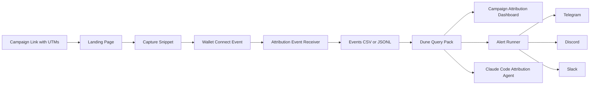

# onchain-attribution-kit

Open-source onchain attribution for Web3 growth teams. Capture UTMs at wallet connect, join campaigns to Dune activity, and send alerts to Telegram, Discord, or Slack.

**Basic setup in ~30 minutes.**

---

## What it is

A free, forkable starter kit that connects off-chain campaign traffic to wallet connections and downstream on-chain actions. It fills the gap between your UTM links and your Dune analytics.

## Who it is for

- Web3 growth leads who need to know which campaigns produce wallets that actually transact
- Protocol engineers who want reusable templates for attribution plumbing
- Web3 growth agencies and consultants who need a repeatable attribution baseline for clients

## What it does not solve

- Multi-wallet identity resolution (one user, multiple wallets)
- Deterministic attribution across more than one touch point
- Bot and sybil detection (wallet quality scoring is a heuristic, not a guarantee)
- Privacy compliance advice
- Hosted analytics or a SaaS dashboard

See [docs/limitations.md](docs/limitations.md) for the full list.

---

## Architecture



---

## Quickstart

```bash
# 1. Clone the repo
git clone https://github.com/gmangabeira/onchain-attribution-kit.git
cd onchain-attribution-kit

# 2. Install dependencies
npm install

# 3. Configure env vars
cp .env.example .env
# Edit .env: set ONCHAIN_ATTRIBUTION_WRITE_KEY and optionally alert vars

# 4. Start the local server
npm run dev

# 5. Open the example page with UTM params
# http://localhost:3000/?utm_source=x&utm_medium=social&utm_campaign=test-launch&utm_content=thread-01

# 6. Click "Connect Wallet" to simulate an attribution event

# 7. Check that an event was stored
cat data/events.jsonl

# 8. Test alert formatting (dry run — no messages sent)
npm run test:alert
```

---

## What's included

### 1. Capture snippet (`src/capture/browser-snippet.ts`)

- Reads UTM params and crypto-native campaign params (`ref`, `kol`, `invite`, `campaign_id`)
- Persists campaign context in `localStorage` for a configurable window (default: 7 days)
- On wallet connect, POSTs an attribution payload to your backend
- Privacy-by-default: no email, IP, or device fingerprint collected
- Opt-out: `window.ONCHAIN_ATTRIBUTION_DISABLED = true`

### 2. Event receiver (`src/server/api.ts`)

- `POST /api/attribution/event` — validates and stores events
- `GET /api/health` — health check
- `GET /api/events.csv` — CSV export for Dune (dev only)
- Auth via `ONCHAIN_ATTRIBUTION_WRITE_KEY` header
- Default storage: append-only JSONL + CSV at `data/events.jsonl` / `data/events.csv`

### 3. Dune SQL query pack (`sql/dune/`)

Five commented, template-style queries:

| File | Purpose |
|---|---|
| `01_campaign_wallets.sql` | Base table of attributed wallets from CSV upload |
| `02_first_onchain_action.sql` | First on-chain action after wallet connect (EVM example) |
| `03_campaign_conversion_summary.sql` | Campaign-level metrics: wallets, conversions, rate, volume |
| `04_channel_quality_score.sql` | Lightweight wallet quality scoring |
| `05_daily_attribution_timeseries.sql` | Daily time series for dashboard charts |

### 4. Alerts (`src/alerts/`)

Three channels supported equally:

| Channel | Format | File |
|---|---|---|
| Telegram | Plain text | `src/alerts/telegram.ts` |
| Discord | Markdown | `src/alerts/discord.ts` |
| Slack | Block Kit | `src/alerts/slack.ts` |

Test alerts:
```bash
# Dry run (no messages sent)
npm run test:alert

# Send to specific channel
ts-node scripts/send-test-alert.ts --channel telegram
```

### 5. Claude Code agent template (`src/agents/claude-code-agent.md`)

Copy-paste prompt for Claude Code to operate daily attribution checks:
- Inspect event files
- Compare campaign performance
- Detect anomalies
- Draft daily summaries with careful attribution language
- Recommend scale / pause / inspect per campaign

### 6. Documentation (`docs/`)

- [Setup guide](docs/setup.md)
- [Campaign schema and UTM taxonomy](docs/campaign-schema.md)
- [Dune setup](docs/dune-setup.md)
- [Alerts overview](docs/alerts.md)
- [Telegram setup](docs/telegram.md)
- [Discord setup](docs/discord.md)
- [Slack setup](docs/slack.md)
- [Multi-chain notes](docs/multi-chain-notes.md)
- [Limitations](docs/limitations.md)
- [Troubleshooting](docs/troubleshooting.md)

---

## Attribution payload schema

```json
{
  "event_id": "uuid",
  "event_type": "wallet_connected",
  "wallet_address": "0x...",
  "chain_id": 1,
  "connected_at": "2026-05-28T12:00:00Z",
  "session_id": "uuid",
  "landing_url": "https://yourprotocol.xyz/?utm_source=x&utm_campaign=launch",
  "referrer": "https://x.com/...",
  "utm_source": "x",
  "utm_medium": "social",
  "utm_campaign": "launch-q2-2026",
  "utm_content": "thread-01",
  "utm_term": null,
  "campaign_id": "launch-q2-2026",
  "ref": null,
  "kol": null,
  "attribution_model": "last_touch",
  "metadata": {}
}
```

---

## Environment variables

| Variable | Required | Description |
|---|---|---|
| `ONCHAIN_ATTRIBUTION_WRITE_KEY` | Yes | Secret key for event POST auth |
| `PORT` | No | Server port (default: 3000) |
| `EVENTS_FILE` | No | JSONL storage path (default: data/events.jsonl) |
| `ATTRIBUTION_WINDOW_DAYS` | No | Attribution window in days (default: 7) |
| `ALERT_CHANNELS` | No | Comma-separated: telegram,discord,slack |
| `TELEGRAM_BOT_TOKEN` | For Telegram | Bot token from @BotFather |
| `TELEGRAM_CHAT_ID` | For Telegram | Chat or channel ID |
| `DISCORD_WEBHOOK_URL` | For Discord | Webhook URL from server settings |
| `SLACK_WEBHOOK_URL` | For Slack | Incoming webhook URL |

---

## Production considerations

This kit is designed for local/dev use out of the box. Before running in production:

1. **Auth:** The write key is a shared secret. Move to per-campaign keys or signed JWTs for higher-volume production use.
2. **Storage:** Replace `LocalFileAdapter` with a Postgres or Supabase adapter for durability and query access.
3. **CORS:** Restrict `Access-Control-Allow-Origin` to your frontend domain.
4. **HTTPS:** Run behind a reverse proxy (nginx, Cloudflare) with TLS.
5. **Rate limiting:** Add rate limiting middleware to the event endpoint.

---

## License

MIT — free to use, fork, and adapt. See [LICENSE](LICENSE).

---

Need help adapting this to your protocol? Book an attribution stack review at [mangabeira.net](https://mangabeira.net).
